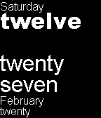
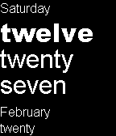
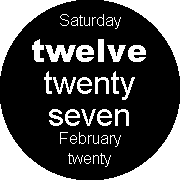
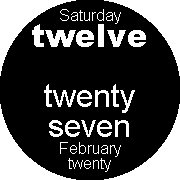
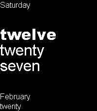
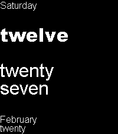

# Sliding Text++
Sliding Text++ Watchface for Pebble

Copyright © 2016 Teal Dulcet

What made [Pebble’s classic Sliding Text](https://github.com/pebble-examples/sliding-text) watchface iconic is that words spell the time, as opposed to numbers.  Sliding Text++ additionally has the day of week, month and day fully spelled out. It includes support for the 24-hour time format and has a menu image, both of which Pebble’s Sliding Text watchface do not have.

Sliding Text++ supports the Pebble Classic, Pebble Steel, Pebble Time, Pebble Time Steel, Pebble Time Round, Pebble 2 and Pebble Time 2 (Aplite, Basalt, Chalk, Diorite and Emery hardware platforms).

Please visit [tealdulcet.com](https://www.tealdulcet.com/) to support this watchface and my other software development.

## Aplite

## Basalt

## Chalk

## Diorite

## Emery

