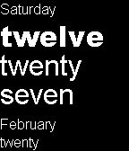
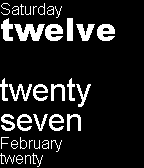
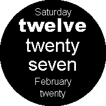
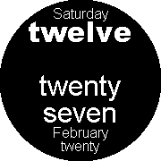
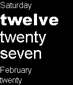
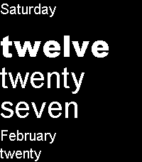
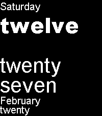
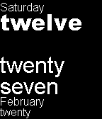
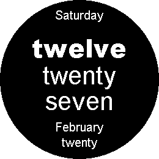
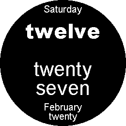

# Sliding Text++
Sliding Text++ Watchface for Pebble

Copyright © 2016 Teal Dulcet

What made [Pebble’s classic Sliding Text](https://github.com/pebble-examples/sliding-text) watchface iconic is that it used words to spell the time, as opposed to numbers. Sliding Text++ additionally has the day of week, month and day fully spelled out. It also includes support for the 24-hour time format and has a menu image.

⌚ Sliding Text++ supports the Pebble Classic, Pebble Steel, Pebble Time, Pebble Time Steel, Pebble Time Round, Pebble 2, Pebble Time 2, Pebble 2 Duo and Pebble Round 2 (Aplite, Basalt, Chalk, Diorite, Emery, Flint and Gabbro hardware platforms).

❤️ Please visit [tealdulcet.com](https://tealdulcet.com/) to support this watchface and my other open source software development.

⬇️ Download from the [Rebble app store](https://apps.rebble.io/en_US/application/58636289e09e636615000110) or the [rePebble app store](https://apps.repebble.com/en_US/application/58636289e09e636615000110).

## Screenshots

### Aplite

### Basalt

### Chalk

### Diorite

### Emery

### Flint

### Gabbro

